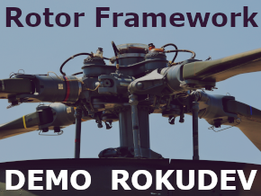

# Rotor POC Application

### Introduction

Modern frameworks like React, Flutter, and state manager like Redux weren't arbitrarily created; they address specific development challenges, validating their relevance. Applying these principles to Roku platform design ensures efficient development, scalability, and user satisfaction.  
I believe that these modern development patterns can be adapted to Roku while respecting the platform's limitations and official development guidelines.

This project was created to prove the feasibility of a Roku-friendly reactive application. The Rotor framework consists of two subsystems that work together: 
* ViewBuilder 
* Multi-thread MVI pattern

#### Builder Example:

```js
    m.appFw.render({
        sgName: "LayoutGroup",
        fields: {
            translation: [90, 60],
            itemSpacings: [60]
        },
        children: [
            {
                sgName: "Label",
                fields: {
                    text: "Simple TodoList Example (driven by Rotor Framework)",
                    font: "font:LargeSystemFont"
                }
            },
            {
                id: "todoList",
                viewModel: ViewModels.TodoList
            }
        ]
    })
```

#### MVI Example; at ViewModel level:

```js
    override sub onCreateView()

        m.props.list = []

        m.todoListDispatcher = m.getDispatcher("todoList")
        m.todoListDispatcher.addListener({

            mapStateToProps: sub(props, state)
                props.list = state.list
                props.counter = state.counter
            end sub

        })

    end sub
```

#### MVI Example; at Widget level:

```js
    onSelected: sub(widget)
        widget.context.dispatcher.todoList.dispatch({
            type: IntentType.TODO_LIST.ADD_TODO,
            payload: {
                description: m.props.description
            }
        })
    end sub
```


#### How to run POC App
- Rename `.vscode/sample.settings.json` to `.vscode/settings.json`
- Rename `sample.env` to `.env`
    - Set variable: `ROKU_DEV_TARGET=<your Roku device's local IP>`
    - Set variable: `ROKU_DEV_PASS=<device developer password>`
 
- Run `npm install`
- Use VSCode Launch > Run Debug | Run Tests

---


# Rotor Framework

Documentation is coming soon...
but you can find some very useful diagrams that try to describe the concepts.

[Documentation](src/source/rotorFramework/README.md)


## Contribute

For any questions ping me ([@Balázs Molnár](https://rokudevelopers.slack.com/team/U05UR749546)) on the Roku Developers Slack channel.


## Credits

##### Icons:
This project uses icons from the Android Asset Studio, which are licensed under the **Apache License 2.0**. For more information about the icons and the license, please visit the following website: Android Asset Studio: https://github.com/romannurik/AndroidAssetStudio

##### App icon:
Modified image of the original: https://www.publicdomainpictures.net/en/view-image.php?image=152257&picture=main-rotor-of-puma-helicopter  
Lynn Greyling has released this “Main Rotor Of Puma Helicopter” image under **Public Domain** license. It means that you can use and modify it for your personal and commercial projects.  
Image editor with which I modified the original: GIMP

##### Theme decoration images
All theme decoration images were downloaded from https://www.rawpixel.com and under **Public Domain** license.  
such as the pink flamingo sticker: https://www.rawpixel.com/image/6283207/png-sticker-public-domain


