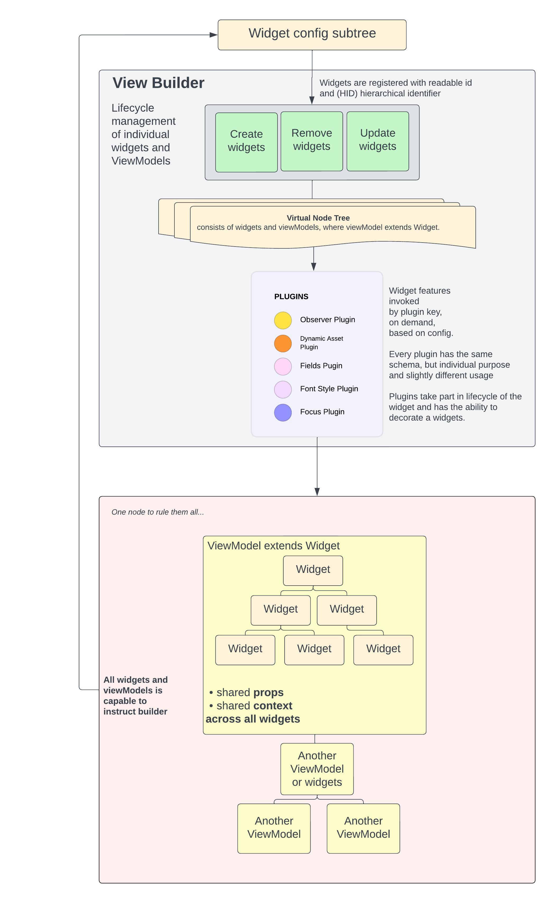
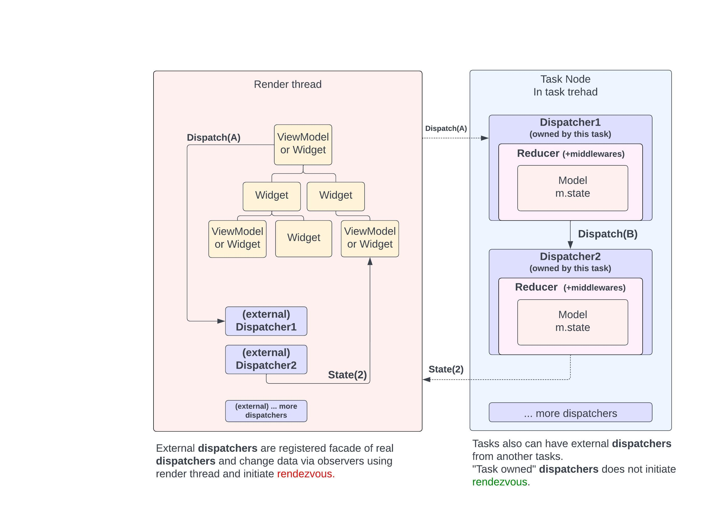

# Rotor Framework

The framework consists of two subsystems along the thread types:
* **View Builder**  
Implemented and running in render-thread
* **Multi-Thread MVI** architecture pattern  
Implemented and running in task-thread


## View Builder



### Plugins

Detailed guides are coming about:
* How to use existing plugins (doc per plugin)
* How to write new plugins

#### List of plugins have already been implemented (by me)

- Rotor.DynamicAssetContextPlugin
- Rotor.FieldsPlugin
- Rotor.FontStylePlugin
- Rotor.FocusPlugin    Rotor.DispatcherProviderPlugin
- Rotor.ObserverPlugin
- Rotor.OnReadyExpression

Some plugins are dramatically simple while some others are very complex.
Focus plugin is very complex but implements innovations which make it easy to use in a tree of widgets. 
 
##### Focus plugin features:
- **Spatial navigation** within focus group (focusables do not need to be children of group, just descendant) 
    - distance measuring is based on point-to-segment calculations 
    - detecting rotated segments
- **Focus bubbling** (along ancestors) by direction
- **Focus capturing** (along descendants)
- Relation between focusables and groups are calculated in runtime
- No need to specify additional id dor groups od focusables, they are using the widget's readable id.


### Assets

Framework implements strategy to provide assets in multiple ways, but these are totally **optional**.
- Asset file: "assetsJs/themes.js" -> Transpiled to: "scr/assets/data/theme.brs"
- Asset file: "assetsJs/translation.js" -> Transpiled to: "scr/assets/data/translation.brs"
- Precompiled injection feature (optional), example: ```"{#theme=safeAreaOffsets}"```
- `Fields plugin` has the ability to directly access assets, example: ```uri: "#theme.busySpinner.url",```

Note that you can use your own strategy such as a bs file based asset system. At the end assets will be assigned to a node's interface by the **Fields Plugin**.


## Multi-thread MVI



#### Thread rendezvous

The most exciting topic. One dispatch is very cost-effective because they are small.

- **Type of States**: States are always of the type Associative Array.
- **State Changes**: It's imperative that state changes occur exclusively within `reducers`.
- **Handling large data structures**: Developers should prioritize placing larger data structures within `contentNodes` in the __new__ state. This is achieved by overriding the corresponding node reference in the state (or create new). Additionally, developers must ensure they avoid reading or modifying interfaces of old nodes. Essentially, `reducers` can create **new** nodes and serve them, but they should refrain from operating on old nodes.
- **Note**: There's a consideration to implement state filtering before the reducer is called.


More ideas and descriptions and explanations coming soon...
